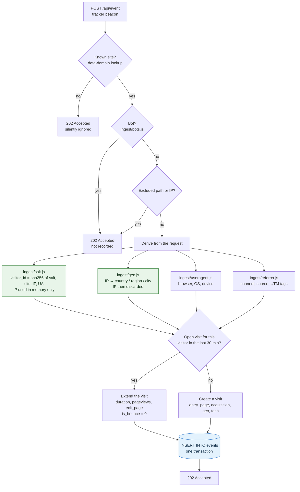

# Architecture

Credible is a single Node.js process with no dependencies, serving a small HTTP API over a
SQLite file. This document explains how a pageview becomes a number on a dashboard, why the
schema looks the way it does, and where the design stops working.

- [The short version](#the-short-version)
- [Request lifecycle](#request-lifecycle)
- [The ingest path](#the-ingest-path)
- [The two-table model](#the-two-table-model)
- [Why sessionization happens at ingest time](#why-sessionization-happens-at-ingest-time)
- [Timezones and bucketing](#timezones-and-bucketing)
- [The query path](#the-query-path)
- [Scaling notes](#scaling-notes)
- [Directory map](#directory-map)

## The short version

```
browser ──▶ public/js/cr.js ──▶ POST /api/event ──▶ ingest ──▶ SQLite ──▶ stats ──▶ dashboard
```

Four design decisions shape everything else:

1. **Sessionization is done at write time**, so session metrics are column reads rather than
   self-joins.
2. **Dimensions are denormalised onto every event row**, so breakdowns rarely need a join.
3. **Time bucketing is computed in JavaScript** and pushed to SQL as unix-second ranges,
   because SQLite has no IANA timezone database.
4. **Identity is a hash that expires**, so there is no user table to join against, ever.

## Request lifecycle

A visitor loads a page carrying the snippet:

```html
<script defer data-domain="yourdomain.com" src="https://YOUR-INSTANCE/js/cr.js"></script>
```

1. **The tracker loads.** `public/js/cr.js` is served as a static file — 13 KB minified,
   4.5 KB over the wire once gzipped, built from `tracker/src/credible.js` by
   `tracker/build.js`. It is plain ES5 with no bundler and no transpiler, so it runs in any
   browser without a polyfill, and the build does not mangle identifiers so the served file
   stays auditable.
2. **The tracker sends a beacon.** On load it POSTs a small JSON body to `/api/event`:
   the event name, the current URL, the referrer, and the screen width. It reads nothing from
   the device — no cookie, no `localStorage`. It also watches for history changes so single
   page apps report navigation, and sends an `engagement` event with time-on-page and scroll
   depth when the visitor leaves.
3. **The server routes the request.** `src/server.js` is a small router plus a static file
   handler and an error boundary; handlers are registered in `src/routes.js`.
4. **Ingest processes it.** The request is turned into one `events` row and one
   created-or-extended `visits` row. This is the interesting part, below.
5. **The dashboard queries it.** The browser app calls the stats endpoints, which build bound
   SQL from a declared dimension table and return JSON.

The visitor's request is answered immediately; nothing about rendering their page waits on
analytics work.

## The ingest path



The two green steps are where the privacy model lives: the raw IP is used to compute a
country and a salted hash, and is then dropped. It is never written to the database and never
written to the log. See [PRIVACY.md](PRIVACY.md) for the full scheme.

Unknown domains, bots, and excluded paths all get a `202` rather than an error. An analytics
endpoint should never give a caller a reason to retry, and should never leak which domains an
instance is configured for. The one exception is the per-IP rate limit, which answers `429`.

`POST /event` and `POST /api/events` are aliases of `/api/event`, and `public/js/script.js` is
a byte-identical copy of `cr.js`. Together they mean a site migrating from Plausible can
repoint the `src` of its existing snippet and change nothing else.

Each accepted beacon is written in one `BEGIN IMMEDIATE` transaction that covers both the
`visits` upsert and the `events` insert, so an event and its session are never half-written.
What keeps that affordable on a single SQLite writer is the pragma set in `src/db/index.js`:
WAL journalling, `synchronous = NORMAL`, and a 5-second `busy_timeout`. In WAL mode with
`NORMAL`, a commit does not `fsync` — the checkpointer does — so the per-event cost is a
sequential append rather than a disk flush, and readers never block the writer.

Cross-request write batching is the obvious next step if that ceiling is ever reached.
`CREDIBLE_FLUSH_INTERVAL_MS` and `CREDIBLE_FLUSH_MAX_BATCH` are reserved for it and are
currently accepted but unused: there is no buffer in front of the writer today, and an event
is durable in the WAL by the time the `202` is sent.

## The two-table model

There are two tables that matter. Everything else is accounts, sites, goals, and the salts.

**`events`** — one row per tracked interaction, the source of truth. Alongside the identity
and timing columns it carries the fully denormalised context of the hit: acquisition
(`channel`, `referrer_source`, `referrer`, the five UTM columns), geography (`country_code`,
`region`, `city`), technology (`browser`, `os`, `device`, `screen_size`), the custom `props`
payload, `revenue`, and engagement measurements.

**`visits`** — one row per session, a maintained aggregate. It holds `started_at`,
`last_event_at`, `duration`, `pageviews`, `events`, `is_bounce`, `entry_page`, `exit_page`,
plus the acquisition, geography and technology of the *first* hit of the session.

That denormalisation is deliberate. A normalised schema would need a join to answer "top
pages from Google in France on mobile"; here the filter and the grouping are columns on the
same row, and SQLite reads it straight from `events_site_ts_idx`. The cost is disk — roughly
100–200 bytes per event — which is the cheapest resource involved.

Storing the first hit's context on the visit is what makes "which channel brought the people
who converted" answerable: attribution belongs to the session, not to the individual event
that happened to record the conversion.

## Why sessionization happens at ingest time

This is the single most important decision in the codebase.

Bounce rate, visit duration, entry pages, exit pages, and views per visit are all
*session*-scoped. Computing them at query time means, for every dashboard load, grouping the
whole event table by visitor, ordering by timestamp, finding the gaps longer than the
inactivity timeout, and deriving first and last rows per group. That is a window function
over a full scan, and it gets slower every day the instance runs.

Instead, ingest does the work once, when the event arrives and the answer is cheap to find:
look up the visitor's most recent visit (`visits_lookup_idx` on
`site_id, visitor_id, last_event_at DESC`), and either extend it or start a new one. The
result is that a query for bounce rate is `avg(is_bounce)` over an indexed range — a column
read whose cost is proportional to the period you asked for, not to the lifetime of the
database.

The trade-offs, stated honestly:

- **Ingest does more work per event.** It is a few indexed statements inside a transaction
  that was already happening, so this is a good deal.
- **Changing `CREDIBLE_INACTIVITY_TIMEOUT` does not rewrite history.** Existing visits keep
  the boundaries they were written with; only new events use the new value.
- **Late-arriving events must find their visit**, which is why the visit lookup is by
  `last_event_at` rather than by anything derived from wall-clock now.

The 30-minute inactivity window is the industry convention, which matters mostly because it
makes numbers comparable with other tools.

## Timezones and bucketing

Every dashboard number is expressed in the *site's* timezone, but events are stored as unix
seconds in UTC. SQLite has no IANA timezone database, so `datetime(ts, 'localtime')` cannot
be trusted for arbitrary zones, and naive offset arithmetic breaks twice a year.

So bucketing is computed in JavaScript, in `src/util/time.js`, using `Intl.DateTimeFormat` —
which does know about DST and historical offset changes. A request for "last 30 days in
Europe/Paris" becomes a list of bucket boundaries as unix-second ranges, and those ranges are
what reach SQL. The database only ever compares integers.

This is why a day boundary is exactly right across a DST transition, why the 23-hour and
25-hour days in a graph have correct totals, and why the query planner can still use
`events_site_ts_idx`: the predicate stays a plain `timestamp BETWEEN ? AND ?`.

One asymmetry is worth knowing: **salt rotation is keyed to UTC days**, not to the site's
timezone, because the salt is global to the instance while timezones are per site. A visitor
active across UTC midnight is counted as two unique visitors for a site whose local day has
not ended. That is a small, deliberate over-count in the privacy-preserving direction.

## The query path

A dashboard request carries a site, a period, a set of filters, and what to break down by.

1. **`src/stats/query.js` builds a scope.** Every dimension the UI can group or filter by is
   declared in the `DIMENSIONS` table (`event:page`, `visit:source`, `visit:country`, and so
   on), each mapping to a table and a real column. **Nothing outside that table ever reaches
   SQL**, and every value is bound as a parameter — there is no string interpolation of user
   input in the query builder. That is the primary defence against injection: the set of
   legal column references is a fixed list in the source, not something derived from a
   request.
2. **`src/stats/index.js` runs the query.** Event-scoped metrics (visitors, pageviews,
   breakdowns) read `events`; session-scoped metrics (bounce rate, visit duration, entry and
   exit pages) read `visits`. Both are driven by the same scope, so a filter applies
   consistently across every panel on the page.
3. **Results are returned as JSON**, and the same endpoints back the Stats API. The dashboard
   is a normal client of the public API rather than a privileged path, which keeps the API
   honest.

Unique visitor counts are `count(DISTINCT visitor_id)` over the period. Because the hash
rotates daily, a visitor active on three days in a 30-day period counts as three uniques in
that period's total. Every cookieless analytics tool has this property; it is the direct
consequence of not keeping an identifier that outlives the day.

## Scaling notes

Be clear-eyed about the ceiling. SQLite in WAL mode allows many concurrent readers and
**exactly one writer**. Credible batches writes into transactions, so the writer is rarely
the bottleneck first — but it is the bottleneck eventually.

Rough expectations on a small VPS with an SSD, and these are estimates rather than benchmark
results:

| Scale | Verdict |
|---|---|
| Up to ~1M events/month | Comfortable. Dashboards feel instant |
| ~1M–50M events/month | Fine. Watch dashboard latency on long periods |
| ~50M–500M events total | Works, with care: use retention, keep the file on local SSD |
| Beyond that | Use something else |

Things that help before you move:

- **Local disk, always.** SQLite over NFS or a network volume can corrupt the database.
  Fly.io volumes and normal VPS disks are fine; shared network storage is not.
- **Set `CREDIBLE_RETENTION_DAYS`.** Most people do not query three-year-old raw events.
- **`VACUUM` after a large deletion** to reclaim the space.
- **Keep the WAL healthy.** Checkpointing is automatic; a permanently large `-wal` file means
  a reader is holding a long transaction open.

Signals it is time to move: writes falling behind during traffic peaks, `SQLITE_BUSY` in the
logs under normal load, dashboard queries taking seconds on common periods, or a need for
more than one machine — for high availability, or for readers and writers in different
regions.

Where to go: **ClickHouse** is the natural destination and is what Plausible and most
large-scale analytics products use, because analytics queries are almost entirely
`GROUP BY` over columns and a columnar store answers them an order of magnitude faster.
**DuckDB** is the interesting middle ground: still an embedded, single-file engine — so the
operational simplicity survives — but columnar and vectorised, which suits this workload far
better than a row store. Since `src/stats/query.js` is the only place that emits SQL, an
alternative backend is a contained change rather than a rewrite. It is on the roadmap, and it
is not built yet.

The honest framing: the single-file design is chosen for the 99% of sites that will never
approach these numbers, and it is not a claim that SQLite is the right engine at any scale.

## Directory map

```
bin/
  credible.js           CLI entry point: serve, seed, user:add, site:add, export, version

src/
  config.js             All configuration, environment driven. No config file exists
  server.js             HTTP server: router, static files, error boundary
  routes.js             Route handlers, registered against the router
  sites.js              Site records, path/IP exclusion rules
  goals.js              Goals, conversions, funnels

  auth/
    index.js            Password hashing, login sessions, API key verification

  db/
    index.js            SQLite access: pragmas, migrations, cached statements
    schema.sql          The full schema — every column that exists is listed here

  ingest/
    index.js            The pipeline: beacon in, events + visits rows out
    salt.js             Daily rotating salt and the visitor hash. Privacy-critical
    geo.js              IP → country / region / city, in memory only
    useragent.js        User agent → browser, OS, device
    referrer.js         Referrer + UTM → channel and source classification
    bots.js             Bot and crawler filtering

  stats/
    index.js            The stats engine: every dashboard number is produced here
    query.js            Dimensions, filters, scope building. The only place SQL is emitted

  util/
    http.js             Request helpers, JSON responses, CORS and security headers
    time.js             Timezone-correct bucketing via Intl. DST-safe
    log.js              Levelled logging. Never logs an IP address

tracker/
  src/credible.js       Tracker source (ES5)
  build.js              Produces public/js/cr.js — output is committed, CI enforces it

public/
  index.html            Dashboard shell; loads js/app.js as an ES module
  js/cr.js              The built tracker, served to every tracked site
  js/script.js          Byte-identical copy of cr.js, for sites migrating from Plausible
  js/cr.debug.js        Unminified tracker, for debugging a live site
  js/app.js             The dashboard application
  js/world-map.js       Generated world map geometry for the geography panel

demo/
  seed.js               Generates realistic demo traffic for `credible seed`

tools/
  build-world-map.js    Regenerates the map data. Run by hand, not at build time

test/                   node:test suites, run with `node --test`
docs/                   This directory
data/                   Created at runtime. Holds credible.db. Gitignored
```
